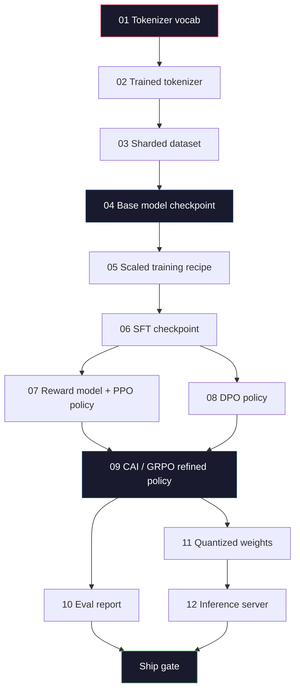
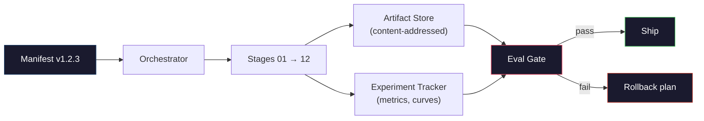

# Building a Complete LLM Pipeline

> Everything from Lessons 01 to 12 is one stage of one pipeline. This lesson is the scaffold that turns those stages into a single end-to-end run: tokenize, pre-train, scale, SFT, align, evaluate, quantize, serve. You will not train a 70B model on a laptop. You will produce the orchestration layer, the manifest, the eval gate, and the rollback plan that a 2026 frontier team uses to decide what gets shipped. This is the capstone.

**Type:** Build
**Languages:** Python (stdlib)
**Prerequisites:** All Phase 10 lessons 01-12
**Time:** ~120 minutes

## Learning Objectives

- Compose the eleven prior lessons (tokenizer, data, pre-training, scaling, SFT, RLHF, DPO, CAI, eval, quantization, inference) into a single reproducible pipeline spec
- Define the artifact contract between stages: what each stage consumes, what it produces, and how the next stage verifies the input
- Build an orchestrator that tracks experiments, hashes artifacts, and gates ship decisions on eval thresholds
- Design the rollback plan: which artifacts are cheap to re-run, which are expensive, and what a corrupted checkpoint costs

## The Problem

The previous lessons each work. Tokenizer trained. Tiny GPT pre-trained. SFT dataset assembled. Reward model trained. DPO run. Evals measured. Quantized weights exported. Inference server spun up. Each one is a notebook. Each one has its own conventions, its own output paths, its own seed.

A frontier training run is not a notebook. Llama 3 405B took 30 million H100 hours over roughly 54 days. DeepSeek-V3 used around 2.8 million H800 hours. During that time, one corrupted checkpoint, one data contamination, one eval regression can cost a team a week of wall-clock and a month of GPU budget. The way teams survive this is through pipeline hygiene: every stage has a deterministic input, a deterministic output, a manifest, a hash, and a gate.

This is the capstone. You will not run the pipeline end-to-end on a laptop. You will write the orchestrator that coordinates the stages, the manifest that describes the run, the verifier that gates ship decisions, and the replay plan that lets a third party re-run your work from a single file. The code is small; the discipline is large.

The pattern scales from 100M to 1T parameters unchanged. The same four components -- manifest, orchestrator, eval gate, artifact store -- run Llama 3 and also run your hobby GPT. The difference is the size of the numbers inside each stage's config, not the shape of the pipeline.

## The Concept

### The Twelve Stages

Every Phase 10 lesson is a stage. Here is the full dependency graph.



Stages 07 and 08 can run in parallel. Everything else is a hard dependency. A change in stage 02 (tokenizer) invalidates every downstream artifact. A change in stage 10 (eval) invalidates only the ship decision.

### The Manifest

A manifest is a single file that describes a run completely enough to replay it. Nothing the pipeline produces should depend on state that is not in the manifest. The fields are boring and mandatory.

```
pipeline_version: 1.2.3
seed: 42
git_commit: a1b2c3d4
stages:
 01_tokenizer:
 recipe: bpe_32k
 input_hash: sha256:...
 output_hash: sha256:...
 wall_clock_sec: 3600
 cost_usd: 12
```

The output hash of stage N is the input hash of stage N+1. Any deviation and the pipeline halts. This is how you catch data corruption early. It is also how a teammate on a different continent verifies that their replay produced the same artifact as yours.

In practice teams use a small YAML schema plus a manifest checker that diffs against the previous successful run. Any delta outside the expected fields (cost, wall clock) is a red flag.

### Artifact Typing

Each stage's output is a typed artifact. Not a directory blob, not a pickle, but a named type with a known schema.

| Stage | Artifact Type | Key Fields |
|-------|--------------|-----------|
| 01-02 | Tokenizer | vocab.json, merges.txt, config.json, hash |
| 03 | Dataset | shards[], row count, token count, dedup stats |
| 04-05 | Checkpoint | weights.safetensors, config.json, optimizer state, step count |
| 06 | SFT Model | checkpoint + SFT recipe + data mix |
| 07 | Reward Model | RM checkpoint + preference data hash |
| 08-09 | Policy | checkpoint + reference hash + beta + KL budget consumed |
| 10 | Eval Report | benchmark scores + regression diffs + eval data hash |
| 11 | Quantized Model | quantized weights + calibration data + accuracy delta vs FP16 |
| 12 | Server Spec | endpoint + model hash + config + observability hooks |

The typing prevents the most common failure mode: using a stage 08 output as a stage 06 input, shipping a DPO-trained model through the SFT path. Typed artifacts and typed stage signatures make these errors compile-time failures, not day-five failures.

### The Eval Gate

Shipping is not "training finished." Shipping is "training finished and the eval gate passed." The gate is defined before the run starts.

```
gates:
 mmlu: >= baseline + 0.5 # no regression
 humaneval: >= baseline + 1.0
 truthfulqa: >= baseline # no drop
 safety_refusal_rate: <= 0.05
 kl_from_reference: <= 25.0
 cost_total_usd: <= 50000
```

Every gate is a numeric threshold. No "looks good" gates. No subjective sign-offs. If every gate passes, the artifact is marked shippable. If any gate fails, the run is held pending explicit override by a named reviewer, which itself is logged in the manifest.

Two gates catch most disasters. A *regression* gate (the new model must be at least as good as the previous on core benchmarks) catches training bugs. A *KL budget* gate (the aligned policy must not have drifted further than X from its reference) catches alignment overcooking. Every production pipeline has both.

### The Orchestrator

A small piece of code that reads the manifest, dispatches stages, tracks artifacts, and halts on any contract violation. This is not Airflow. This is not Kubeflow. For pipeline hygiene you want something boring that you wrote.

The orchestrator's job is narrow:

1. Resolve the DAG from the manifest.
2. For each stage, check if the expected output already exists at the correct hash (skip if so).
3. Run the stage, capture stdout/stderr, measure wall clock and cost.
4. Verify the output hash against the downstream stage's expected input hash.
5. On failure, write a partial manifest with the exact failing stage and exit nonzero.

That is 200 lines of Python. It will look like the file `code/main.py` in this lesson. Under the hood, the real pipeline uses `torchrun` or `ray` to execute individual stages on clusters, but the orchestrator itself runs on a single box.

### Experiment Tracking and Artifact Storage

Two external systems anchor the pipeline.

**Experiment tracker (wandb, neptune, mlflow).** Logs loss curves, eval metrics, system telemetry per stage. The tracker is where you go when you need to compare run A against run B three weeks later. Teams almost always use a hosted tracker for this -- writing your own loses time that should go into training.

**Artifact store (S3, R2, GCS).** Immutable object store for checkpoints, datasets, tokenizers, eval reports. Artifacts are addressed by hash, not by filename. A filename like `latest.pt` is a foot-gun; `ckpt-7b-step-20000-sha256:abc123.safetensors` is a contract.

The orchestrator writes to both. The tracker is for humans looking at charts. The artifact store is for the next stage looking up inputs.

### Costing

A frontier run has a dollar number attached. Budget discipline happens in two places.

**Pre-run estimate.** From the manifest, compute expected FLOPs (for pre-training: 6 x params x tokens), expected GPU hours (FLOPs / peak throughput / utilization), and dollar cost at the current rental rate. If the estimate exceeds the budget gate, the pipeline refuses to start.

**In-run tracking.** Stage-by-stage wall clock and cost are logged to the manifest. After every stage, the remaining budget is checked. If a stage overran, the next stage's gate is evaluated with the new remaining budget. You do not find out you are out of money when the VC calls.

Llama 3's reported cost was $61M. DeepSeek-V3 reported $5.6M for the main pre-training run. The ratio is mostly hardware efficiency plus mixture-of-experts -- but the specific cost is visible because both teams tracked it per stage, not per run.

### Reproducibility vs Determinism

These are not the same. *Reproducible* means the same manifest plus the same code plus the same infrastructure produces a checkpoint with equivalent downstream metrics. *Deterministic* means bit-identical output.

Modern LLM training is reproducible but not deterministic. Distributed training's reduce-order, GPU kernel non-determinism (cuBLAS, flash-attn), and mixed precision rounding combine to produce floats that differ at the 1e-5 level between runs. This is fine for the final metrics, which do not move. It is fatal if you are trying to debug with bit-level diffs. The cure is to log every stage's input hash, output hash, and headline metrics -- if those match, the run is "reproduced" even if the weights are not bit-identical.



### Rollback Plan

Before the run starts, write down what happens on failure of each stage. Three categories.

- **Cheap to re-run** (hours): tokenizer, eval, quantization, inference server. Just re-run.
- **Medium** (days): SFT, DPO, CAI. Keep the base model; re-run only the alignment stages.
- **Expensive** (weeks and millions of dollars): pre-training. The rollback plan here is not "re-run." It is "use the last good checkpoint and re-run the cheaper downstream stages with revised data."

Because stage dependencies are typed and hashed, the orchestrator can compute the rollback set automatically: invalidate the failed stage plus every descendant. A failure at stage 06 (SFT) invalidates 06, 07, 08, 09, 10, 11, 12. A failure at stage 11 (quantization) invalidates only 11 and 12. Naming this up front avoids improvising while the team is exhausted at 4am.

### Production Recipes Observed in 2026

Most frontier teams converged on the same skeleton.

- Tokenizer: 128k BPE with byte fallback. Trained on a small, balanced multilingual slice.
- Pre-training: 10-20T tokens, mostly web plus code plus synthetic. Muon or AdamW optimizer. FSDP2 or DeepSpeed ZeRO-3. Gradient checkpointing. BF16 weights, FP32 master.
- SFT: 500k-2M instruction pairs, mixed human and synthetic, with strict dedup against the eval set.
- Alignment: DPO or CAI + GRPO. RLHF only where the preference signal is too multidimensional for DPO.
- Eval: MMLU-Pro, MATH, HumanEval+, GPQA, SWE-Bench Verified, LiveBench, plus a private held-out set the public never sees.
- Quantization: 4-bit GPTQ or AWQ for serving, 8-bit for safety evals where accuracy deltas matter.
- Serving: vLLM, TensorRT-LLM, or in-house. Continuous batching. Speculative decoding. KV cache eviction.

The numbers change every six months. The skeleton does not.

## Build It

The lesson's code is an orchestrator and a manifest checker, not twelve training scripts. Each stage is simulated with a placeholder that produces an output artifact with the correct shape and hash. Running the orchestrator end-to-end proves the pipeline's plumbing works before you burn GPU money on the real stages.

See `code/main.py` for the full implementation. The key pieces:

- `Manifest` dataclass: pipeline version, seed, git commit, stages, gates.
- `Stage` dataclass: name, type, inputs (hashes), output (hash), wall clock, cost.
- `Orchestrator.run()`: resolves DAG, dispatches stages, verifies hashes, updates manifest.
- `EvalGate.check()`: reads thresholds, compares against latest eval report, returns pass/fail.
- `ArtifactStore` (in-memory stub): put/get by hash, simulates S3.
- `CostTracker`: per-stage and cumulative, halts when cap exceeded.

The pipeline in `main.py` runs twelve placeholder stages, produces a manifest, and exercises a failing eval gate to show what a held run looks like. Swap each placeholder for the real training script from the corresponding lesson and you have the skeleton a real frontier pipeline uses.

## Use It

The canonical workflow has three commands.

```
python code/main.py plan # validate manifest, compute cost estimate, print DAG
python code/main.py run # execute stages, writing to manifest.out.yaml
python code/main.py gate # read manifest.out.yaml, apply eval gates, ship-or-hold
```

Run `plan` first every time. Most pipeline bugs show up at plan time -- missing gate thresholds, stale hashes, budget overruns. Running `plan` is free. Running `run` is expensive. Save money by catching bugs on the cheap side.

The output of `gate` is either `SHIP` or `HOLD: <reason>`. A held run is not a failure; it is a decision point. A named reviewer either overrides (and the override is logged), or they approve the rollback.

## Ship It

This lesson produces `outputs/skill-llm-pipeline-reviewer.md`. Feed it a proposed pipeline manifest and it checks all the contracts: stage typing, hash chain, gates, rollback plan, cost estimate. It refuses to approve a manifest with a missing eval gate, an unbounded KL budget, or a run that mixes eval and training data.

## Exercises

1. Extend the orchestrator to support parallel execution of stages 07 and 08. Use the stdlib `concurrent.futures` module. Confirm the final manifest records both stages' outputs and that stage 09's input hash is a deterministic combination of both.

2. Add a "contamination check" gate. Given the eval dataset hash and the training dataset shards, compute the overlap (exact string match or 13-gram match). The gate fails if overlap exceeds 0.1%. Feed it a contaminated training set and confirm the gate holds the run.

3. Implement a cost estimator from first principles. For stage 04 (pre-training), estimate FLOPs as 6 x params x tokens, assume 40% MFU (model FLOPs utilization) on H100 at 989 TFLOPs BF16, at $2.50/GPU-hour. Report the estimate for a 7B model trained on 2T tokens. Compare to published Llama 2 numbers.

4. Build a partial rollback. Simulate a failure at stage 09 (CAI), then re-run stages 09 through 12 while leaving 01-08 cached. The orchestrator should detect the cached artifacts by hash and skip them. Measure wall-clock saved versus full re-run.

5. Add observability. Emit OpenTelemetry spans for each stage, with attributes for params, tokens seen, loss, and cost. Pipe the spans to a local collector. The point is not dashboards; the point is that every stage's health is traceable from a single trace ID.

## Key Terms

| Term | What people say | What it actually means |
|------|----------------|----------------------|
| Manifest | "The recipe file" | YAML or JSON describing pipeline version, seed, per-stage config, and gate thresholds — sufficient to replay a run |
| Content-addressed | "By hash not name" | Artifacts stored by SHA-256 of their contents, so you can never confuse version A with version B |
| Eval gate | "The ship criteria" | Numeric thresholds on benchmark metrics and safety scores that must pass before an artifact is marked shippable |
| KL budget | "How far alignment drifted" | A cap on cumulative KL(policy || reference) across alignment stages, enforced as a gate |
| MFU | "How much of the GPU you used" | Model FLOPs Utilization — achieved FLOPs divided by theoretical peak. 40% is typical at 70B scale, 55% at 7B |
| Rollback plan | "What we do when it breaks" | Pre-written set of actions per stage on failure: re-run, fall back, retrain with revised inputs |
| Orchestrator | "The conductor" | The process that reads the manifest, dispatches stages, verifies hashes, halts on any contract violation |
| Artifact store | "Versioned S3 for weights" | Immutable content-addressed object store — single source of truth for checkpoints, datasets, eval reports |
| Reproducible | "Same metrics on replay" | Different bit-level weights but equivalent downstream metrics — the realistic target for distributed LLM training |
| Cost gate | "You cannot exceed X" | Pre-run cost estimate plus in-run tracker — the pipeline refuses to start if the estimate exceeds budget |

## Further Reading

- [Dubey et al., 2024 -- "The Llama 3 Herd of Models"](https://arxiv.org/abs/2407.21783) -- the most detailed public description of a frontier pipeline including data, training, alignment, eval
- [DeepSeek-AI, 2024 -- "DeepSeek-V3 Technical Report"](https://arxiv.org/abs/2412.19437) -- efficiency-first pipeline at roughly 1/10th the cost of Llama 3 class training
- [Kaplan et al., 2020 -- "Scaling Laws for Neural Language Models"](https://arxiv.org/abs/2001.08361) -- the original compute-data-params scaling relationship
- [Hoffmann et al., 2022 -- "Training Compute-Optimal Large Language Models (Chinchilla)"](https://arxiv.org/abs/2203.15556) -- the correction to Kaplan that recalibrated modern data budgets
- [PyTorch FSDP2 documentation](https://pytorch.org/docs/stable/fsdp.html) -- the distributed training primitive replacing FSDP1 in PyTorch 2.4+
- [Weights & Biases LLM Reports](https://wandb.ai/site/llms) -- real manifests and experiment tracker output for open-source LLM runs, useful as plagiarizable templates
