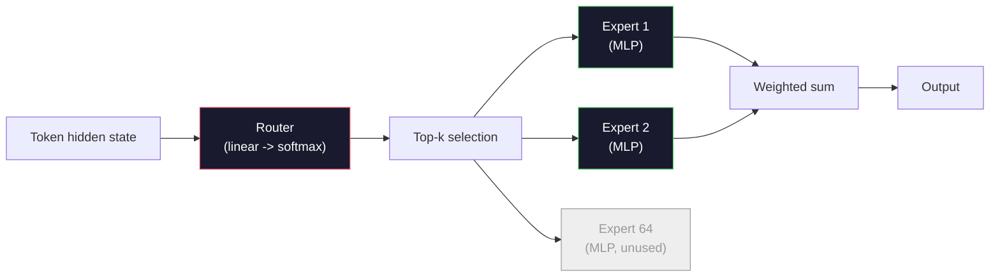

# Open Models: Architecture Walkthroughs

> You built a GPT-2 Small from scratch in Lesson 04. Frontier open models in 2026 are the same family with five or six concrete changes. RMSNorm instead of LayerNorm. SwiGLU instead of GELU. RoPE instead of learned positions. GQA or MLA instead of full MHA. Mixture-of-Experts at scale. The math you already know covers 95% of them. This lesson reads Llama 3, DeepSeek-V3, Mixtral, Qwen, and Gemma side by side and names the exact line where each architecture diverges.

**Type:** Learn
**Languages:** Python (stdlib)
**Prerequisites:** Phase 10, Lessons 04, 05, 12 (Pre-training, Scaling, Inference)
**Time:** ~45 minutes

## Learning Objectives

- Read the config.json of Llama 3, Mistral, Mixtral, Gemma 2, Qwen 2.5, and DeepSeek-V3 and explain every field
- Name the specific architectural change each model made versus GPT-2 Small and justify it from first principles
- Compute parameter count, KV cache size, and activation memory for any open model from its config alone
- Pick the right open model for a deployment target given latency, memory, and capability constraints

## The Problem

In Lesson 04 you wrote 350 lines of numpy and had a GPT-2-shaped model. Llama 3 405B has a 200-page technical report. Your instinct is that these are different beasts. They are not. The 200 pages describe the same object with five or six well-motivated modifications, plus a thousand implementation details about scaling. The skeleton -- embedding, transformer blocks, attention, MLP, norm, head -- is unchanged.

This lesson is a diff. For each major open model family, we list exactly what changed from GPT-2, why, and what it cost. When you are done you can read a fresh model card and mentally translate it back to the GPT-2 baseline.

The practical payoff is that when Meta releases Llama 5 or DeepSeek releases V4, you will not need a new mental model. You will look at the config, see which of the well-known knobs moved, and know what the downstream implications are. The 2026 architectures are a finite toolbox. Each new model picks a different subset.

## The Concept

### The Invariant Core

All autoregressive open models share:

- Token embedding matrix (vocab_size x hidden_dim).
- Stack of N decoder blocks: norm, self-attention, residual, norm, MLP, residual.
- Final norm and linear head projecting to vocab_size (often weight-tied with embeddings).
- Causal mask, next-token cross-entropy loss.

That is the shape. The rest is knobs.

### The Six Knobs That Actually Move

Across every 2024-2026 frontier open model, the same six design choices get picked over and over:

1. **Normalization.** LayerNorm -> RMSNorm.
2. **Positional encoding.** Learned absolute -> RoPE (plus variants: YaRN, NTK).
3. **Activation.** GELU -> SwiGLU (or GeGLU).
4. **Attention head sharing.** MHA -> GQA -> MQA -> MLA.
5. **Dense vs sparse MLP.** Dense -> Mixture-of-Experts.
6. **Pre-norm placement.** Pre-norm stays. Post-norm is gone.

Everything else (learning rate schedule, data mix, batch size, context length) lives in the training config, not the architecture. Six knobs.

### Knob 1: RMSNorm

LayerNorm subtracts mean, divides by std, scales, and shifts. RMSNorm keeps only the scale:

```
RMSNorm(x) = x / sqrt(mean(x^2) + eps) * gamma
```

No mean subtraction. No bias. One matmul fewer per token. Zhang and Sennrich (2019) argued it matched LayerNorm on machine translation while being 10% faster. Every modern open model runs it.

Cost: none. Benefit: small throughput win, simpler code.

### Knob 2: RoPE

Learned position embeddings were a 1024-slot lookup table in GPT-2. Context 1025 is off the end of the table. Models cannot extrapolate beyond their training length.

Rotary Position Embedding (RoPE, Su et al. 2021) injects position by rotating each Q and K vector in pairs before the attention dot product. The angle of rotation is a deterministic function of position, so there is nothing learned and nothing to run out of. With scaling tricks (NTK-aware interpolation, YaRN), a model trained on 8k context can stretch to 128k at inference with modest accuracy loss.

```
q_rotated = rotate(q, angle(pos))
k_rotated = rotate(k, angle(pos))
score = q_rotated. k_rotated
```

Every Llama, Mistral, Qwen, DeepSeek, and Gemma uses RoPE. Gemma 2 uses a hybrid (RoPE on most layers, local sliding-window attention on others).

### Knob 3: SwiGLU

GPT-2's MLP is `x -> gelu(xW1 + b1) -> (...)W2 + b2`. SwiGLU (Shazeer 2020) replaces the activation with a gated product:

```
SwiGLU(x) = (xW1) * sigmoid(xW1) * xV
```

Two projections in parallel instead of one, gated by the Swish activation. Empirically stronger on perplexity per parameter. Llama 2 adopted it, everyone followed. The MLP's hidden size is usually set so that total parameter count matches the original dense MLP: if GPT-2 used `ff_dim = 4 * hidden`, SwiGLU uses `ff_dim = (2/3) * 4 * hidden = 8/3 * hidden`.

### Knob 4: Attention Head Sharing

GPT-2 used **Multi-Head Attention (MHA)**: every head has its own Q, K, V projection.

**Multi-Query Attention (MQA, Shazeer 2019)** shares one K and one V across all heads. Cuts the KV cache by num_heads, which is a 12x to 32x reduction on a typical model. Accuracy drops slightly on hard benchmarks.

**Grouped-Query Attention (GQA, Ainslie et al. 2023)** is the middle ground: G groups of Q heads share one K and one V. Llama 3 8B uses GQA with 32 Q heads and 8 KV heads (G=8), so the KV cache shrinks 4x versus full MHA.

**Multi-Head Latent Attention (MLA, DeepSeek 2024)** compresses K and V into a shared low-rank latent, projecting them back up per head. Further reduces KV cache while preserving per-head expressiveness. DeepSeek-V2 and V3 rely on this for their long-context performance.

| Scheme | KV Heads | KV Cache | Accuracy |
|--------|----------|----------|----------|
| MHA | num_heads | full | best |
| GQA | num_groups (G < num_heads) | num_heads / G reduction | near-MHA |
| MQA | 1 | num_heads reduction | small hit |
| MLA | latent, per-head decompression | smaller than MQA | near-MHA |

For any model above ~13B parameters, GQA or MLA is effectively mandatory. Full MHA at scale is a KV cache disaster.

### Knob 5: Mixture of Experts

A dense MLP activates all its parameters for every token. An MoE MLP has K experts per block and a router that picks the top-k experts per token (typically top-2). Only those experts' weights see a forward pass for that token.

```
router_logits = xW_r
indices, weights = top_k(router_logits, k=2)
output = sum_i weights[i] * expert[indices[i]](x)
```

The appeal: you can have 64 experts of size 7B each (so total param count is huge) while only running 2 of them per token (so per-token compute matches a dense 7B model). Mixtral 8x7B has 47B total parameters but activates only 13B per token. DeepSeek-V3 has 671B total parameters but activates only 37B per token.



Pros: same compute, more parameters, better capacity. Cons: the expert memory still has to live somewhere (so serving needs more VRAM than a dense equivalent), load-balancing the router is hard, and fine-tuning the router during alignment is its own research area.

### Knob 6: Pre-norm stays

The original transformer applied layer norm after each sublayer. Every open model since GPT-2 puts it *before* each sublayer. Pre-norm is strictly easier to train at depth. Nothing to argue about.

### Model-by-Model Diff

Here is the table that makes all of this concrete.

| Model | Year | Total Params | Active Params | Norm | Activation | Position | Attention | MoE | Context |
|-------|------|-------------|---------------|------|-----------|----------|-----------|-----|---------|
| GPT-2 Small | 2019 | 124M | 124M | LayerNorm | GELU | Learned | MHA (12 heads) | no | 1k |
| Llama 3 8B | 2024 | 8B | 8B | RMSNorm | SwiGLU | RoPE | GQA (32/8) | no | 128k |
| Llama 3 70B | 2024 | 70B | 70B | RMSNorm | SwiGLU | RoPE | GQA (64/8) | no | 128k |
| Llama 3 405B | 2024 | 405B | 405B | RMSNorm | SwiGLU | RoPE | GQA (128/16) | no | 128k |
| Mistral 7B | 2023 | 7.2B | 7.2B | RMSNorm | SwiGLU | RoPE | GQA | no | 32k |
| Mixtral 8x7B | 2023 | 47B | 13B | RMSNorm | SwiGLU | RoPE | GQA | yes (8 experts, top-2) | 32k |
| Gemma 2 9B | 2024 | 9B | 9B | RMSNorm (pre+post) | GeGLU | RoPE + sliding | GQA | no | 8k |
| Qwen 2.5 72B | 2024 | 72B | 72B | RMSNorm | SwiGLU | RoPE (YaRN) | GQA (64/8) | no | 128k |
| DeepSeek V2 236B | 2024 | 236B | 21B | RMSNorm | SwiGLU | RoPE | MLA | yes (160 experts, top-6) | 128k |
| DeepSeek V3 | 2024 | 671B | 37B | RMSNorm | SwiGLU | RoPE | MLA | yes (256 experts, top-8) | 128k |

Scan the columns. RMSNorm is universal. SwiGLU or its GeGLU cousin is universal. RoPE is universal. GQA is universal above 7B except when replaced by MLA. MoE is the differentiator at the top end.

### Reading a config.json

Llama 3 8B config:

```
{
 "hidden_size": 4096,
 "intermediate_size": 14336,
 "num_hidden_layers": 32,
 "num_attention_heads": 32,
 "num_key_value_heads": 8,
 "max_position_embeddings": 131072,
 "rope_theta": 500000.0,
 "rms_norm_eps": 1e-5,
 "vocab_size": 128256
}
```

Every field corresponds to something you have already implemented.

- `hidden_size`: embedding dimension.
- `intermediate_size`: MLP hidden size (3.5x hidden -- SwiGLU math).
- `num_hidden_layers`: stack depth.
- `num_attention_heads`: Q heads.
- `num_key_value_heads`: KV heads (GQA).
- `max_position_embeddings`: training context length.
- `rope_theta`: RoPE base frequency. Meta scaled it from the default 10k to 500k for long-context extrapolation.
- `rms_norm_eps`: numerical stability.
- `vocab_size`: tokens.

From these alone you compute total parameters, KV cache, and peak activation memory. See `code/main.py` for the exact formulas.

### Activation memory budget

Activations dominate training memory above a few billion parameters. The rule of thumb for pre-training (with gradient checkpointing):

```
activation_mem ~ batch_size * seq_len * hidden_size * num_layers * bytes_per_element
```

For Llama 3 8B at batch 1, seq 8192, BF16, 32 layers, hidden 4096: roughly 8 GB just for activations with checkpointing, 40 GB without. This is why flash-attention and ring-attention matter -- they rewrite the attention computation so activations fit.

### KV Cache budget

For inference at max context:

```
kv_cache = 2 * num_layers * num_kv_heads * head_dim * max_seq_len * bytes_per_element
```

Llama 3 8B at 128k context, BF16, head_dim = hidden / num_heads = 128:
`2 * 32 * 8 * 128 * 131072 * 2 = 17.2 GB` per sequence.

The 8B weights are 16 GB in BF16. The KV cache for a single 128k sequence is larger than the weights. This is the memory pressure driving GQA, MLA, and KV cache quantization research.

### When Each Model Wins

- **Single 80GB GPU, no MoE**: Llama 3 8B, Mistral 7B, Gemma 2 9B. Easy to serve, wide tooling.
- **Single node (8x80GB), big capacity**: Llama 3 70B, Qwen 2.5 72B. Highest dense open capability.
- **Biggest open capability, accept MoE complexity**: DeepSeek V3, Mixtral 8x22B. Best capability per active FLOP.
- **Long-context needs**: Llama 3 (128k with RoPE scaling), DeepSeek (MLA advantage).
- **Low-latency serving**: Gemma 2 9B (sliding window cuts long-context compute).

## Build It

The lesson's code is a calculator. Given any config.json, it prints parameter count by component, KV cache at max context, SwiGLU MLP ratio, and a short verdict on the architecture (dense / GQA / MLA / MoE).

```python
config = {
 "hidden_size": 4096, "intermediate_size": 14336,
 "num_hidden_layers": 32, "num_attention_heads": 32,
 "num_key_value_heads": 8, "vocab_size": 128256,
 "max_position_embeddings": 131072,
}
```

The script walks the architecture field by field, computes param counts for embedding, attention (with GQA reduction), MLP (with SwiGLU expansion), layernorms, and the head. It then computes the KV cache at the stated context length and prints a summary.

See `code/main.py` for the implementation.

## Use It

Run the calculator on Llama 3 8B, Mistral 7B, Mixtral 8x7B, and DeepSeek V3 configs bundled in the script. Compare the parameter breakdowns. Notice that the MoE models have a total param count that dwarfs the dense models but an active param count that is often smaller. Notice that DeepSeek V3's KV cache is smaller than Llama 3 405B's despite having more total parameters -- that is MLA in action.

Then plug in a config for any model you have locally, read the summary, and decide whether it fits your GPU.

## Ship It

This lesson produces `outputs/skill-open-model-picker.md`. Given a deployment target (GPU type, VRAM, context length, latency budget) and a task profile (chat, code, reasoning, long-context), it recommends an open model, a quantization scheme from Lesson 11, and an inference stack from Lesson 12, with explicit reasoning about the six architectural knobs.

## Exercises

1. Read the Qwen 2.5 72B config from HuggingFace. Compute total parameters from scratch. Compare to the HF-reported value and identify where any delta comes from (head dim rounding, KV sharing factor, etc.).

2. DeepSeek V3 uses 256 experts with top-8 routing. Compute the ratio of activated experts to total experts and compare to Mixtral 8x7B's top-2 of 8. What does the shift from sparse (25%) to denser sparse (3%) imply about capacity per FLOP?

3. Compute the KV cache for Llama 3 405B at 128k context in FP8 and BF16. At FP8 it is half the BF16 number. How many parallel sequences can you serve on a single 8xH100 node (80GB each = 640GB total, minus weight memory)?

4. Gemma 2 alternates full-attention and sliding-window-attention layers. Write the math for the KV cache when half the layers use a 4096-token sliding window instead of full context. How much memory does that save at 8k total context?

5. Find a recent frontier open model that was released after this lesson was written. Identify which of the six knobs it picked and whether it introduced a seventh knob. The curriculum will feel out of date the moment a new architecture ships -- the goal is to update your table without rebuilding your mental model.

## Key Terms

| Term | What people say | What it actually means |
|------|----------------|----------------------|
| RMSNorm | "LayerNorm without the mean" | Normalize by root mean square only, with a learned scale — cheaper and comparable to LayerNorm |
| RoPE | "Rotary positions" | Rotate each Q and K vector in 2D pairs by an angle that depends on position — extrapolates beyond training length with scaling tricks |
| SwiGLU | "The new MLP activation" | Gated linear unit with Swish: `(xW1) * sigmoid(xW1) * xV` — standard in every 2024+ open model |
| GQA | "Middle ground attention" | Grouped-Query Attention: G groups of Q heads share one K and one V head — shrinks KV cache without MQA's accuracy hit |
| MLA | "DeepSeek's attention" | Multi-Head Latent Attention: compress K/V into a shared low-rank latent, decompress per head — smallest KV cache for large models |
| MoE | "Sparse experts" | Mixture of Experts: N MLPs per block, router picks top-k per token — huge total params, small active params |
| Top-k routing | "Pick k experts per token" | The router computes a score per expert and activates the k highest — typical k is 2 (Mixtral) to 8 (DeepSeek) |
| YaRN | "Stretch RoPE" | Yet another RoPE extension — interpolates rotary angles to extend context from 8k to 128k+ at inference time |
| Sliding-window attention | "Don't attend to everything" | Each token attends only to the last W tokens — caps attention cost at O(W) per token, used in Gemma 2 and early Mistral |
| Active params | "What runs per token" | For MoE models, the parameter count that sees a forward pass per token (much smaller than total params) — governs per-token FLOPs |

## Further Reading

- [Dubey et al., 2024 -- "The Llama 3 Herd of Models"](https://arxiv.org/abs/2407.21783) -- the architectural and training reference for the dense Llama 3 family
- [DeepSeek-AI, 2024 -- "DeepSeek-V3 Technical Report"](https://arxiv.org/abs/2412.19437) -- MLA plus auxiliary-loss-free load balancing plus 671B MoE
- [Jiang et al., 2024 -- "Mixtral of Experts"](https://arxiv.org/abs/2401.04088) -- the canonical MoE open model paper
- [Su et al., 2021 -- "RoFormer: Enhanced Transformer with Rotary Position Embedding"](https://arxiv.org/abs/2104.09864) -- the RoPE paper
- [Shazeer, 2020 -- "GLU Variants Improve Transformer"](https://arxiv.org/abs/2002.05202) -- SwiGLU, GeGLU, and friends
- [Ainslie et al., 2023 -- "GQA: Training Generalized Multi-Query Transformer Models"](https://arxiv.org/abs/2305.13245) -- the GQA paper
- [Gemma 2 Team, 2024 -- "Gemma 2: Improving Open Language Models at a Practical Size"](https://arxiv.org/abs/2408.00118) -- hybrid full+sliding attention, pre+post-norm
- [Qwen Team, 2024 -- "Qwen 2.5 Technical Report"](https://arxiv.org/abs/2412.15115) -- YaRN context extension and long-context training recipes
